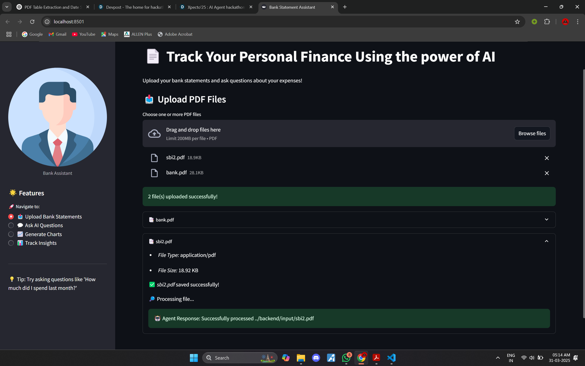
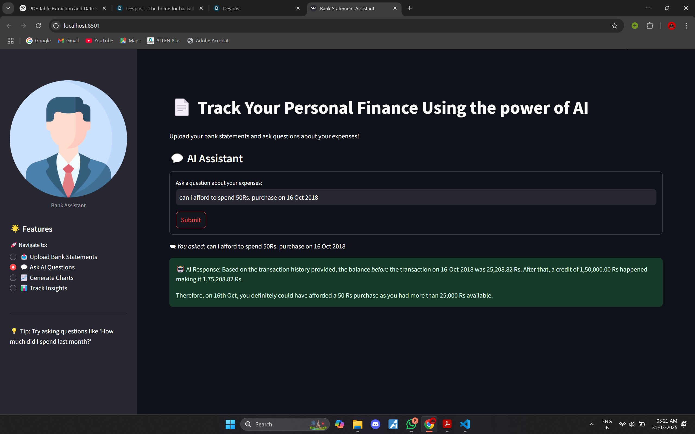
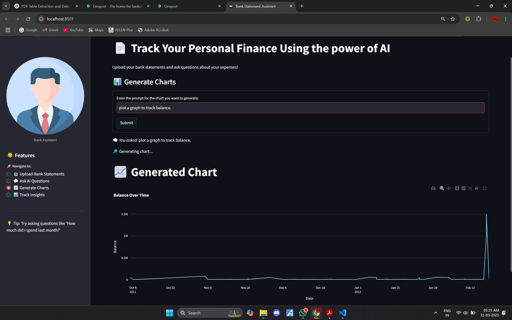
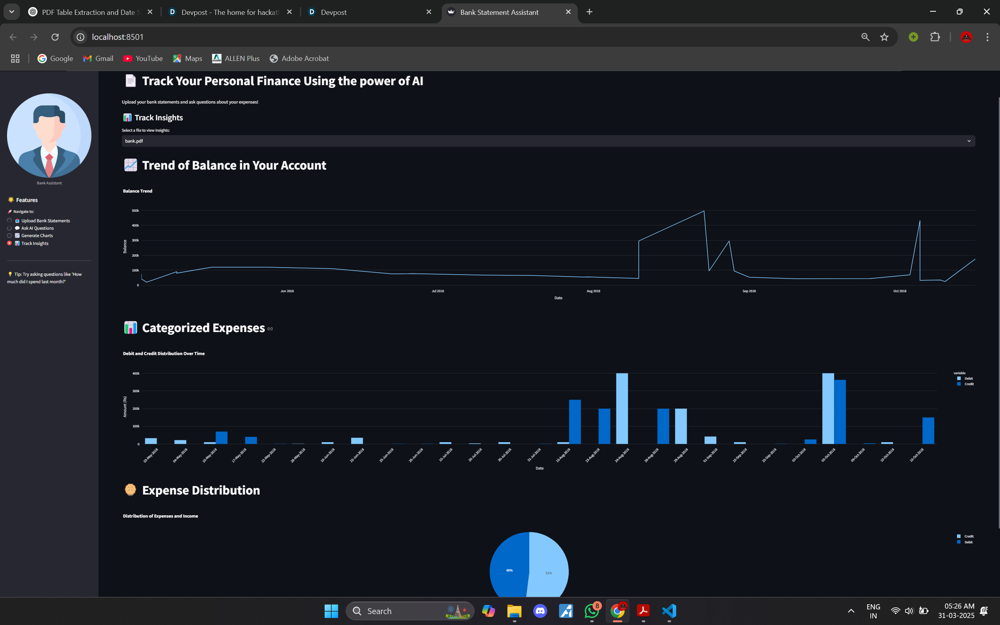

# FrostHack 2025 - Real-time Personal Finance Tracker By Pathway & FetchAI

## 📌 Overview
Welcome to our **Real-time Personal Finance Tracker** project for FrostHack 2025! This project is designed to help users manage and query financial data effectively. The system processes bank statements in PDF format, extracts relevant financial data, and allows users to query this data using natural language. The architecture integrates multiple components to provide a seamless experience, including data extraction, embedding storage, query processing, and visualization.

## 📸 Screenshots

Here are some screenshots of the application in action:

### PDF Upload Page


### AI Chat


### Generate Chart Using AI


### Plots of Insights


### 🔍 How It Works
1. **PDF Processing**: 
   - Users upload bank statements in PDF format through a **Streamlit web app**.
   - The backend processes these PDFs using `pdfplumber` to extract tables and transactions, which are then standardized and converted into text files.

2. **Embedding and Storage**:
   - Extracted text data is split into chunks and embedded using **HuggingFace sentence-transformers**.
   - The embeddings are stored in a **FAISS index** for efficient similarity search.

3. **Query Processing**:
   - Users can ask questions about their financial data through the web app.
   - Queries are processed in two stages:
      - **Retrieve Closest Document**: The system uses the FAISS index, integrated with **Pathway**, to find the most relevant document chunk for the query.
      - **Answer Generation**: The retrieved chunk is passed to **Google Gemini AI** to generate a detailed answer.

4. **Visualization**:
   - Users can request visualizations (e.g., charts) based on their financial data. The system generates Python code using **Google Gemini AI** to create charts dynamically with **Plotly**.

### **Tech Stack**
- **Frontend**: Streamlit for building an interactive web interface.
- **Backend**: Python for data processing and dynamic chart generation and also used MONGODB for files & embeddings storage
- **ASI**: For natural language query processing and visualization.
- **Fetch.AI**: uAgents for defining REST APIs and managing backend functionalities.

## 🛠 Running the Project Locally

### ✅ Prerequisites
Make sure you have the following installed:
- Python (>=3.8)
- pip

### 📥 Installation Steps
1. **Clone the Repository:**
   ```bash
   git clone https://github.com/Bhupesh-Khordia/Frosthack-25.git
   ```
2. **Install Dependencies:**
   ```bash
   pip install langchain langchain_community pdfplumber faiss-cpu google.generativeai google.genai uagents streamlit plotly sentence-transformers pymongo
   pip install -qU langchain_huggingface
   ```
3. **Create a `.env` file:**
      Create a `.env` file in the root directory of the project and add your Gemini API Key to it:
      ```env
      # API keys
      ASI_API_KEY=your_asi_api_key

      #MONGODB
      MONGODB_URI=mongodb+srv://<username>:<password>@cluster0.n2g4kia.mongodb.net/?retryWrites=true&w=majority&appName=Cluster0

      ```
      Replace `your_asi_api_key` with your actual asi key and `mongodb_uri` with your own mongodb_uri
4. **Run all agents in separate terminals:**
   ```bash
   cd backend
   python run fetch_agent.py
   python run embedding_agent.py
   python run query_agent.py
   python run chart_agent.py
   python run delete_agent.py
   ```
6. **Run your app:**
   ```bash
   cd ..
   cd frontend
   streamlit run app.py
   ```

## ✍️ Created By
This project was created by **Team KamandNET2.0** as part of the FrostHack 2025 hackathon. Our team is passionate about leveraging cutting-edge technologies to solve real-world problems. 
### Team Members:
- **Siddhant Shah**
- **Anshul Mendiratta**
- **Bhupesh Yadav**